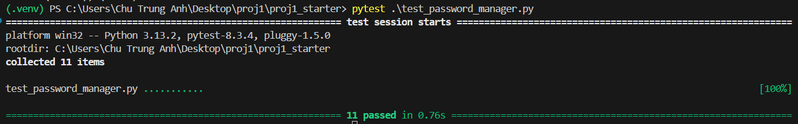

# CS255 Introduction to Cryptography - Project I Password Manager

## Tổng quan

Yêu cầu của bài tập lớn này là tạo ra một chương trình quản lý mật khẩu đơn giản. Các mật khẩu được người dùng đưa vào dưới dạng cặp tên miền và mật khẩu, ví dụ: `example.com:password123` -> trình quản lý mật khẩu sẽ mã hóa và lưu lại với dạng `HMAC("example.com"): AES-GCM("password123")`.

Khi người dùng muốn truy xuất một mật khẩu, người dùng nhập vào tên miền muốn truy xuất, ví dụ: `example.com` -> trình quản lý mật khẩu sẽ giải mã mật khẩu tương ứng với tên miền đó và hiển thị cho người dùng.

## Cách thức hoạt động

Trình quản lý này hoạt động dựa trên các cơ chế bảo mật như sau:

1. Đầu tiên, một khóa chính (master key) sẽ được dẫn xuất từ mật khẩu chính của người dùng bằng hàm PBKDF2. PBKDF2 được thiết kế chậm để chống lại các cuộc tấn công vét cạn.

2. Sau khi có khóa chính, bạn sẽ sử dụng HMAC (với khóa chính làm đầu vào) để tạo ra hai khóa con (sub-keys) khác nhau. Điều này được thực hiện bằng cách đánh giá HMAC tại hai giá trị tùy ý khác nhau.

    - Một khóa con sẽ được sử dụng làm khóa cho hàm HMAC để tính toán MAC (Message Authentication Code) cho các tên miền. Giá trị HMAC này (sau khi được mã hóa thành chuỗi, ví dụ như Base64) sẽ được sử dụng làm khóa (từ "khóa" ở đây là key trong ngữ cảnh key-value, không phải là key để giải mã) trong KVS để lưu trữ mật khẩu tương ứng. Điều này giúp bạn có thể tìm kiếm mật khẩu cho một tên miền cụ thể mà không cần lưu trữ tên miền ở dạng văn bản rõ.

    - Khóa con còn lại sẽ được sử dụng làm khóa cho thuật toán mã hóa xác thực AES-GCM để mã hóa từng mật khẩu riêng lẻ.

Chi tiết hơn xem trong file hướng dẫn `proj1.pdf`.

## Mục đích của việc này là gì

Hệ thống của tata sẽ mã hóa từng bản ghi (tức là từng cặp tên miền-mật khẩu) một cách riêng lẻ. Điều này có nghĩa là mỗi mật khẩu được liên kết với một tên miền (xác thực bằng HMAC) sẽ được mã hóa bằng AES-GCM sử dụng khóa con thứ hai. Việc mã hóa từng bản ghi riêng lẻ giúp bạn không cần phải giải mã toàn bộ cơ sở dữ liệu khi chỉ muốn truy xuất một mật khẩu.

## Cách cài đặt

1. Tải các file cần thiết và giải nén

2. Kích hoạt python virtual environment và cài đặt các thư viện cần thiết:

```bash
python3 -m venv venv
.\.venv\Scripts\activate
pip install -r requirements.txt
```

3. Chạy các test cases với:

```bash
pytest .\test_password_manager.py
```
Kết quả sẽ trông như này:

