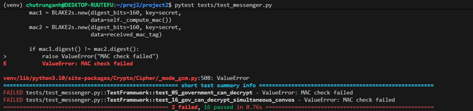

# 1. Mục tiêu của Bài Tập
Xây dựng một client chat mã hóa đầu cuối với các yêu cầu sau:

- Sử dụng thuật toán Double Ratchet (được sử dụng trong Signal, WhatsApp…) để bảo mật liên lạc giữa các client.

- Thêm một yêu cầu “giám sát” từ phía chính phủ: mỗi tin nhắn gửi đi phải kèm theo khóa phiên (session key) được mã hóa bằng khóa công khai cố định của chính phủ.

Project sẽ động đến các khía cạnh sau trong mật mã: trao đổi khóa, mã hóa khóa công khai, chữ ký số và mã hóa xác thực.

# 2. Các nguy cơ bảo mật

- **Forward Secrecy**: Ngay cả khi khóa hiện tại bị xâm nhập, các tin nhắn cũ vẫn không thể giải mã được.

- **Break-in Recovery**: Sau khi bị tấn công, việc gửi một tin nhắn mới sẽ “cứu” lại toàn bộ phiên giao tiếp và khóa của tin nhắn sau đó sẽ không bị lộ.

- **Giám sát của chính phủ**: Mỗi tin nhắn đều phải kèm theo phiên mã hóa của sending key với khóa công khai của chính phủ – chỉ chính phủ và người nhận mới có thể giải mã được.


# 3. Các hàm cần implement

## a. Tạo và xác thực chứng chỉ (Certificate)

- `messenger.generate_certificate(username)`

    - Tạo cặp khóa ElGamal cho việc trao đổi khóa.

    - Đóng gói khóa công khai vào chứng chỉ có chứa thông tin như username.

- `messenger.receive_certificate(certificate, signature)`   

    - Nhận chứng chỉ của người khác và lưu trữ vào hệ thống nội bộ.

    - Kiểm tra chữ ký số từ trung tâm tin cậy (server) để đảm bảo chứng chỉ không bị thay đổi.

## b. Gửi và nhận tin nhắn mã hóa

- `messenger.send_message(name, message)`

    - Nếu chưa có phiên giao tiếp, thiết lập phiên (session) theo thuật toán Double Ratchet.

    - Trên mỗi lần gửi, tăng (ratchet) chuỗi gửi (sending chain) và nếu cần thì cả chuỗi gốc (root chain).

    - Mã hóa tin nhắn bằng AES-GCM với các khóa được dẫn xuất theo hướng dẫn của Signal.

    - Tạo header cho tin nhắn gồm:

        - Thông tin cần thiết để bên nhận có thể dẫn xuất khóa mới.

        - Khóa gửi (sending key) được mã hóa bằng khóa công khai của chính phủ, với các trường: v_gov, c_gov.

        - Các IV (Initialization Vector) ngẫu nhiên: một cho mã hóa khóa gửi của chính phủ (iv_gov) và một cho mã hóa tin nhắn cho người nhận (receiver_iv).

- `messenger.receive_message(name, [header, ciphertext])`

    - Nếu chưa có phiên giao tiếp, thiết lập phiên theo thuật toán.

    - Trên mỗi lần nhận, tăng chuỗi nhận (receiving chain) và nếu cần thì cả chuỗi gốc (root chain) dựa trên thông tin trong header.

    - Giải mã tin nhắn với khóa mới dẫn xuất, đồng thời kiểm tra tính toàn vẹn và phát hiện gian lận (tampering).

# 4. Chạy Project

Chạy trên Window gặp lỗi `AttributeError: module 'signal' has no attribute 'SIGALRM'. Did you mean: 'SIGABRT'?`, thử chạy trên Linux hoặc WSL.

```bash
source venv/bin/activate    # Kích hoạt môi trường ảo
pip install -r requirements.txt  # Cài đặt các thư viện cần thiết
pytest tests/test_messenger.py  # Chạy các bài test
```
Kết quả trông như sau:



*Còn 2 test không vượt qua*
